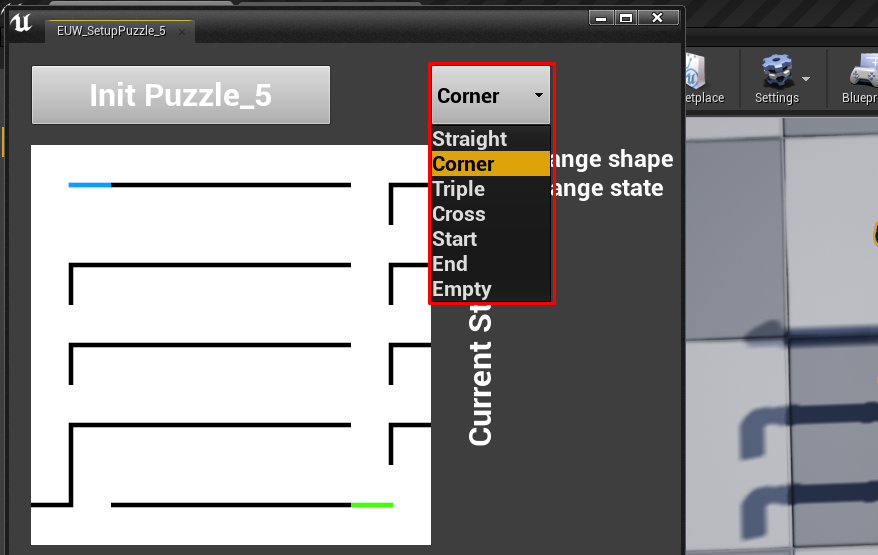

# Editor Utility Widget

For **BP\_Puzzle\_4**, a widget (**EUW\_SetupPuzzle\_4**) was made that opens in the editor for more convenient puzzle settings.


See on [this page](../../info.md) which plugin you need to enable for the widget to work.


## How to use the widget?

1. Select the puzzle set on the level
2. **Right click** on the **EUW\_SetupPuzzle\_4** widget
3. In the context menu that appears, select the **Run Editor Utility Widget** item

.png>)

A widget window will appear.

.png>)

Now with the puzzle selected on the level, click on the Init **Puzzle\_5** button.

.png>)

The widget will take information from the selected puzzle and display it on the screen.

From the drop-down list you can select a shape and when you click on the cells **LMB**, the square will change to the one that is selected in the drop-down list. They will change in the current state and in the win one.

When you **right-click** on a cell, the shape will rotate.

1. You need to set up the state of the puzzle that you need to collect to win.
2. After setting up the puzzle, the screenshot shows that the cells have spawned into each other, in order to fix this, you need to move the puzzle so that everything is updated.

.png>)

After moving the puzzle on the level, everything was updated.

.png>)
